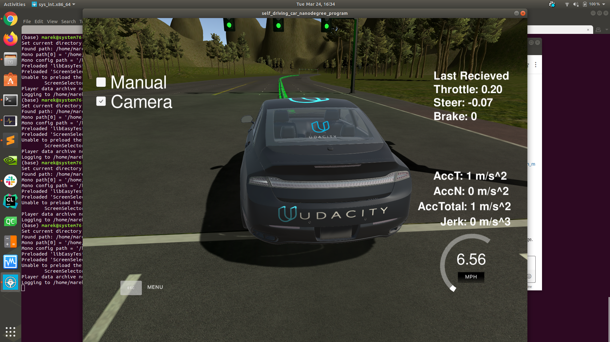
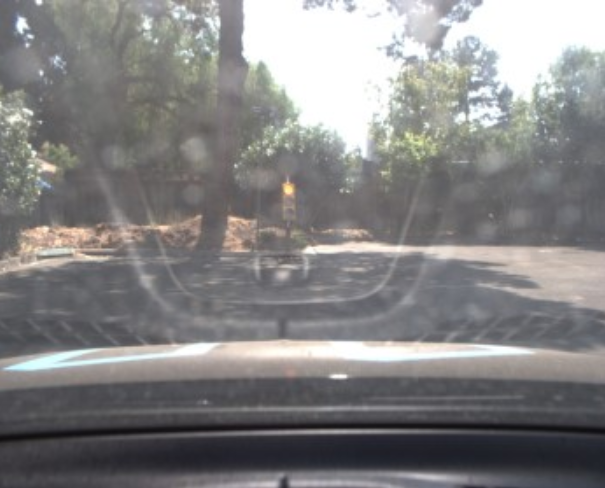
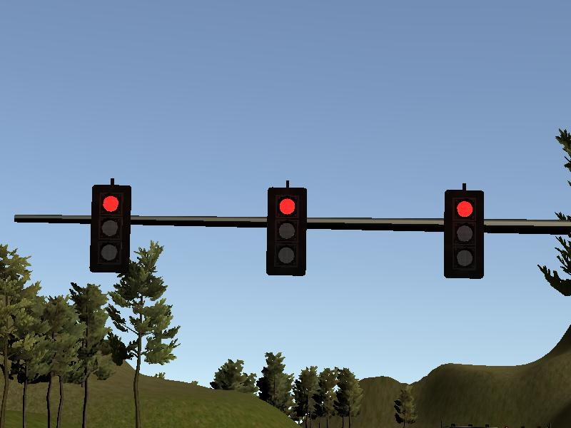
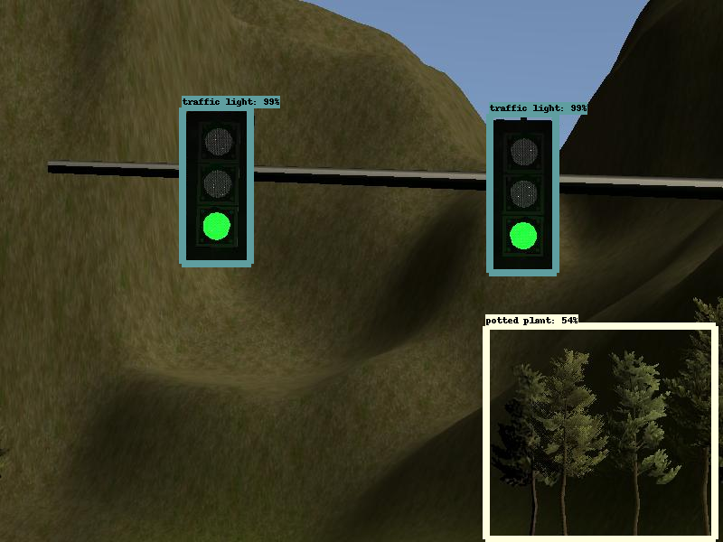

# Self-driving Car Engineer Nanodegree Capstone Project:  Program an Autonomous Vehicle

*Marek Kolodziej, Ph.D. Tim Limyl, M.S., Alejandro Terrazas, Ph.D., Jianzhou Zhao, M.S.*

The purpose of this capstone project is to combine the skills garnered by the students in Udacity Self-driving Car Engineering Nanodegree in order to program Udacity’s Carla self-driving car platform.  The students combined skills in computer vision, vehicle control systems, and integration through the Robot Operating System (ROS; <https://www.ros.org>).

## Project Aims

The project’s aims were scaled down from a full self-driving car application and, instead focused on 
__1)__ staying in a single lane and __2)__ stopping at red traffic lights.  Goals such as changing lanes, planning optimal routes, and reacting to traffic were not included in this project; although these were covered in other projects during the Nanodegree program.

## Project Stages

The project proceeded in two stages.  First, basic elements of the system were developed to run on Udacity’s simulator (***Figure 1***).  The simulator is a virtual reality 3D environment with three lanes of traffic and eight lights.  There are no other cars in the environment.  In order to pass the first test, the simulated vehicle must stop “safely”, that is smoothly and before the white line, at each red light, decide to stop or continue through each yellow light, and continue through each green light at an appropriate speed.  

***Figure 1 Simulator showing car at the starting position.*** *Manual mode allows the operator to use cursor controls and the mouse to drive the car; otherwise, the car is under control of the waypoint generator (see below).  By clicking the camera box, the user is able to see the view from the simlated car's camera.  The simulator software is developed in Unity 3D.  There are eight different lights situated around the circuitous track.*   

Once the software system passes the first test on the simulator, it is transferred to Udacity’s Carla (***Figure 2***) to run on a real-world (albeit greatly simplified) track.  The traffic lights encountered on the test track are substantially different than the traffic lights encountered in the simulator.  Moreover, conditions on the test track include glare and poor contrast among other challenges.   

***Figure 2 Carla. Udacity's Self-driving Car Platform.*** *Carla is a fully equiped self-driving car with sensors, perception modules, a planning system and controls.  Once students can pass the simulator test, they are able to run their software on Carla.*

## Object Detection and Classification System

In order to react correctly to the traffic lights, the software system must achieve __1) detection.__ Identify the traffic light housing with a bounding box and __2)__ Classification.__ Look within the bounding box to determine the state of the light (green, yellow, red).  A single shot detector (SSD; Liu et al. 2016 <https://arxiv.org/abs/1512.02325>) was used for this purpose.


***Figure 3: The SSD neural network architecture.***

The SSD used in this project took advantage of ***transfer learning*** in which a pretrained network is adapted for use in a specific project. The pretrained network selected was from the TensorFlow Zoo, which is a collection of detection models pre-trained on massive datasets. (<https://github.com/tensorflow/models/blob/master/research/object_detection/g3doc/detection_model_zoo.md>). 

Since the automotive hardware is closer to mobile or embedded devices than cloud GPUs, the MobileNet neural network designed for running very efficiently (high FPS, low memory footprint) on mobile devices, is integrated as the base network instead of VGG-16 shown in ***Figure 3***. The MobileNet can reduce the size of cummulative parameters and therefore the computation required on automotive/ mobile hardwares with limited resources (Andrew et al. 2017 <https://arxiv.org/abs/1704.04861>).

As already noted, the virtual camera and the real-world were substantially different (***Figure 4***) The virtual camera on the simulator produces 800 x 600 pixel (height by width) tri-color (blue, green red) images. These images were captured to disk for use in training and testing the computer vision module. In order to address the differences between the simulator and the real-world test track images, a mixture of real and simulator images were used for training, validation, and testing of the computer vision algorithms. Early development of the computer vision system relied on simulation images only. Following success with the simulator testing, additional images from the Bosch Small Traffic Light Dataset <https://hci.iwr.uni-heidelberg.de/node/6132> were mixed in.

<table><tr>
<td>  </td>
<td>  </td>
</tr></table>  

***Figure 4: Traffic light images from Carla (left) and the Udacity simulator (right).***  *Significant differences can be seen between the two images.  In the Carla real-world image, there is significant reflection from the dash upon the windshield that is not present in the simulator image.  Moreover, the simulator traffic lights are always of the overhead variety and come in groups of three housings, while the Carla image contains a single housing mounted on a post.  The sizes of the images are also different.  The differences between the simulator and Carla images make it necessary to train the light detection and classification module using a mixture of real world and simulator images. 

The goal of object detection is to place a bounding box around the object of interest.  ***Figure 5*** below, shows an example image with bounding boxes around detected objects.


 ***Figure 5, Example image showing bounding boxes surrounding detected objects.***  *The image demonstrates correct detection of two traffic light housing and one incorrect detection of trees.  The second stage of the detection and classification is to determine whether the lights are green, yellow, or red.. Moreover, it is necessary to eliminate the false positive (lower right corner) surrounding the trees.  The false positive can be eliminated based on the shape of the bounding box because traffic lights are distinctively shaped as vertically oriented rectangles, while, the false positive is more square in shape. As shown in* ***Figure 4***, *above, the simulator does not contain overhead lights; therefore, looking in the upper part of the image would not work well for the Carla images.*

## Performance of the Traffic Light Detection and Classification System

The performance of the detection and classification system was measured separately.  For detection, the goal is to find correct bounding boxes, with a criterion of mean average precision (mAP; reviewed in <https://towardsdatascience.com/breaking-down-mean-average-precision-map-ae462f623a52>). In order to characterize the performance of the detection and classification system, the following metrics were used: __1)__ precision, and __2)__ recall. Chance performance for traffic lights is 33%.   

The object detection and classification software was written in Python 3.7 and TensorFlow version 1.3/ 1.15.

## Carla

Udacity’s Carla contains subsystems for __1)__sensing, __2)__ perception, __3)__ planning and __4)__ control.  These subsystems are described below.  Figure 5, shows an overview of Carla's subsystems. 

 
***Figure 6.  Architecture of Carla, the Udacity Self-driving Car.*** *The four modules work independently but exchange data via robot operating system (ROS) nodes (see description of ROS under ***Software Used*** below.* Image borrowed from Udacity Self-driving Car Nanodegree course materials.

***Sensing.*** The sensing subsystem is comprised of several cameras, an inertial measurement unit (IMU), and RADAR and LIDAR sensors.  The camera producing the images provided for this project are mounted behind the windshield (see ***Figure 4 (left)***, above).  Not included in this project (but part of Carla) are a RADAR sensor and a LIDAR sensor both of which provide the distance to nearby objects. The RADAR is forward facing and only senses the distance to objects in front of the car.  The LIDAR system has a 360-degree view that provides distance to objects in all directions. The GPS provides an estimate of position in global coordinates with 1-2 meters resolution. The IMU estimates displacement of the car in the x (forward-backward), y (left-right) and z (up-down) directions, along with the angular displacement.  

None of the individual sensors are sufficient for localizing the car to the degree needed for safe driving.  Therefore, sensor fusion (combining sensor data) is necessary. GPS coordinates for the lights and car location are provided in the simulator and on the test track; therefore, it is possible to anticipate upcoming lights.

***Perception.***  As in neural and cognitive science, perception differs from sensation in that the perception takes the raw input from the sensor and elaborates it into meaningful information.  Meaningful information for a car include traffic light detection and classification (as included in this project), obstacle detection, traffic sign detection, detection of other cars, and, pedestrians.  A substantial part of the effort in the Capstone project involved perceiving the state of the traffic lights.  

***Planning.***  Self-driving cars (and the drivers they will replace) always need to think ahead.  The planning subsystem is built on the concept of ***waypoints***—a series of coordinates that are updated as the car moves through the environment.  For example, a lane change to the left might be comprised of 20-40 equidistant waypoints in the form of a smooth *s* shape over a 30 meter span.  Note: there is no requirement that the waypoints are equidistant, extend 30 meter, nor that there are 20-40 waypoints that describe the trajectory.  In dense traffic, the parameters may vary substantially from the parameters in sparse traffic.  A real-world planning subsystem would be adaptive to the situation.  Again, this is similar (in concept, if not in detail) to how neural planning systems work.  ***Figure 6*** shows examples of path planning.

 ***Figure 6: Example Path Planning Trajectories for lane changing in heavy traffic.***  *In this example, a multitude of possible paths are considered; however, most of the paths do not have the desired outcomes.  The goal of an effective path planning module is to smoothly transition between cars (and other objects) while maximizing safety and comfort for the passenger.  The path planner must consider the speed of the car ahead in the lane as well as the car to the side and oncoming traffic and generate the correct combination of acceleration and steering to avoid other cars and land in the gap.* Example taken from path planning course materials from Udacity's Self-driving Car Engineer Nanodegree.

***Control.***  Finally, after planning comes execution of the commands that control the car.  As in human driving, there are a limited number of controls that, in combination, create a complex series of behaviors.  Carla is equipped with a drive-by-wire controller to control __1)__ acceleration, __2)__ braking and __3)__ steering.  Carla uses a proportional-integral-derivative (PID) controller.  

## The Testing Track

After passing the simulator test, the testing moved to the real world using Carla. Some minor modification to the code (setting flags) was necessary in order to run the code on Carla; however, the goal was to produce one software system that could successfuly drive *without human intervention* on both the simulator and Carla.

## Software Used

### Robot Operating System (ROS)

ROS (Robot Operating System) provides libraries and tools to help software developers create robot applications. It provides hardware abstraction, device drivers, libraries, visualizers, message-passing, package management, and more. ROS is licensed under an open source, BSD license.

The robot operating system is an open source software framework developed initially by Willow Garage (www) and is ideally suited for complex robot operations that often involve multiple systems running independently. For example, the multiple modules in Carla include: __1)__ a camera that produces raw images, __2)__ the object detection and classification system which consumes the raw images and produces the state of the light (i.e., green, yellow, red), __3)__ a decision-making system that decides whether to stop at a light or continue through it, and __4)__ the vehicle control system that is responsible for steering, accelerating and decelerating the car, just to name a few.  Indeed, most robots and autonomous vehicles are may contain dozens of interacting modules. Writing a single program that integrates all of the modules in a self-driving car would be very challenging, to say the least. 

 ***Figure 7: ROS architechure showing the ROS nodes and topics used in the project.***

ROS allows these systems to run independently while, at the same time, exchanging messages. The main mechanism for communicating between modules is through a “publisher-subscription” (commonly referred to as a “pub-sub” model). In certain cases, asynchronous communications, in which one sub system can interrupt and block the processing of another system, are required. ROS supports both message passing protocols.

Another important benefit of using ROS is the large number of device drivers that are included with the distribution.  These device drivers support many of the most popular sensors (cameras, LIDAR, RADAR, IMU) and actuators (motors and controls). The easy integration of the supported devices means that developers are able to focus more effort on integration.

ROS has several tools that aid in the development of an integrated system. The system developer can “peer into” the messages being exchanged and store these in a “[bag](http://wiki.ros.org/Bags)” file, which can can be replayed to the system.  Replaying past data ensures that conditions can be replicated during failure analysis.

## Installation and Execution

### In the Udacity workspace / on Carla

We found the Udacity workspace to be extremely slow - even without the deep learning model, ROS nodes wouldn't get the data from the simulator fast enough, and so the simulator feedback was delayed so much so as not to meet real-time requirements. However, we assume that something was wrong with the state of the VMs in which our workspaces were running, and it's not a systemic problem. It is possible to run the code in a workspace environment if the hardware is more responsive, and therefore to run on Carla as well. The Docker environment discussed below allowed us to deploy on a system that was fast enough for real-time to pass the simulator submission.

Note that the default setup in the codebase is for the Docker environment, which uses TensorFlow 1.15. The Udacity workspace/Carla steps below mention where to change the TensorFlow model import from 1.15 to 1.3. Please note that if the Udacity workspace environment proves to be too slow for grading like it did for us (again - too slow even without the deep learning-based traffic light detector), we recommend the Docker steps mentioned after this section to run on any reasonably well-powered laptop (not to mention workstation) - the code should be fast enough even without GPU acceleration.

Workspace steps:

* Clone the repo:
```
git clone https://github.com/CarNDCapstone/CarND-Capstone.git && cd CarND-Capstone/ros
```
* Run catkin_make
```
catkin_make
```
* Load env vars
```
source devel/setup.bash
```
* Change from TF 1.15 (Docker) to 1.3 (workspace)
Either change `TF_VERSION = "1.15"` to `1.3` in `src/tl_detector/light_classification/tl_classifier.py`, or type the following while being in the `ros` subdirectory of the repository:
```
git apply workspace.patch
```
* Start ROS nodes
```
roslaunch launch/styx.launch
```
* Start the Udacity simulator as usual
### In a Docker container

0. **Hardware specs tested**

Before we talk about installing the software and running it, let's talk about the hardware characteristics. The simulator takes a lot of CPU power, as does ROS. If the neural network is running on CPU too, that will further tax the CPU. If a GPU is available, that would lighten CPU load at least, but in any case, the available resources have to be adequate. We're listing 2 setups we tried, which were fast enough for the model to run at expected frame rates.

* Setup 1:
    * Linux laptop (2019 System76 Oryx Pro)
    * Ubuntu 18.04 LTS
    * 32 GB RAM
    * 6-core Intel CPU (Intel(R) Core(TM) i7-9750H CPU @ 2.60GHz)
    * NVIDIA RTX 2070 GPU (CUDA compute capability 7.5, Turing architecture)
    * [Docker 19.03.8](https://www.docker.com/)
    * [nvidia-docker](https://github.com/NVIDIA/nvidia-docker)
* Setup 2:
    * Apple laptop (2019 Macbook Pro)
    * MacOS Catalina (10.15.3)
    * 32 GB RAM
    * 6-core Core i7 CPU
    * Docker for MacOS with virtualization via HyperKit

1. **Clone the repository**

The repository can be found [here](https://github.com/CarNDCapstone/CarND-Capstone). To clone the repository, do

```
git clone https://github.com/CarNDCapstone/CarND-Capstone.git
```
Also, make sure you change directories to get inside the repo
```
cd CarND-Capstone
```

2. **Set up Docker** 

This setup depends a [Docker](https://www.docker.com/) image. If you'd like to know more about Docker containers, click [here](https://www.docker.com/resources/what-container).

**Why Docker?**
* Makes software portable across platforms, like a virtual machine.
* Zero overhead when run on Linux (VMs can have a lot overhead - definitely I/O, sometimes compute, depending on the [hypervisor](https://en.wikipedia.org/wiki/Hypervisor))
* GPU acceleration - VMs don't allow the user to run CUDA. This is because CUDA in a Linux VM would expect to talk to a native Linux driver, but the host OS could be Linux, Windows or MacOS. By contrast, Docker containers running on Linux hosts can access CUDA-capable GPUs for compute (see the GPU Acceleration section below).


**Docker runtime installation instructions**

* [Ubuntu Linux](https://docs.docker.com/install/linux/docker-ce/ubuntu/)
* [CentOS Linux](https://docs.docker.com/install/linux/docker-ce/centos/)
* [RHEL Linux](https://docs.docker.com/ee/docker-ee/rhel/)
* [MacOS](https://download.docker.com/mac/stable/Docker.dmg)
* [Windows](https://download.docker.com/win/stable/Docker%20Desktop%20Installer.exe)

**Note:** the authors only tested the setup on Ubuntu Linux and MacOS.

**GPU acceleration:** This code uses neural network detection and classification for the traffic light model. GPU acceleration is only available in this setup when Docker runs natively on Linux. Fortunately, our detection model is fast enough on a CPU, but using GPU acceleration is recommended whenever possible.

Supported GPUs include: Tesla K80, Tesla M60, Tesla P100, Tesla V100, GTX 1070/1080/1080Ti, RTX 2070/2080/2080Ti. Titan X, Titan XP and Titan RTX should also work.

To get GPU acceleration, after installing Docker, you'll need to install [nvidia-docker](https://github.com/NVIDIA/nvidia-docker). We're copying the nvidia-docker instructions from the [NVIDIA github repo](https://github.com/NVIDIA/nvidia-docker) here.

*nvidia-docker setup on Ubuntu Linux*

```
# Add the package repositories
distribution=$(. /etc/os-release;echo $ID$VERSION_ID)
curl -s -L https://nvidia.github.io/nvidia-docker/gpgkey | sudo apt-key add -
curl -s -L https://nvidia.github.io/nvidia-docker/$distribution/nvidia-docker.list | sudo tee /etc/apt/sources.list.d/nvidia-docker.list

sudo apt-get update && sudo apt-get install -y nvidia-container-toolkit
sudo systemctl restart docker

```

*nvidia-docker setup on CentOS 7 / RHEL 7*

```
distribution=$(. /etc/os-release;echo $ID$VERSION_ID)
curl -s -L https://nvidia.github.io/nvidia-docker/$distribution/nvidia-docker.repo | sudo tee /etc/yum.repos.d/nvidia-docker.repo

sudo yum install -y nvidia-container-toolkit
sudo systemctl restart docker
```

If you have an NVIDIA GPU and correctly installed Docker and nvidia-docker, running a CUDA container (will be pulled automatically) should show your driver version (here 440.59) and GPU type (here GeForce RTX 2070):

```
docker run --rm -it nvidia/cuda nvidia-smi
Sun Mar 29 21:32:42 2020       
+-----------------------------------------------------------------------------+
| NVIDIA-SMI 440.59       Driver Version: 440.59       CUDA Version: 10.2     |
|-------------------------------+----------------------+----------------------+
| GPU  Name        Persistence-M| Bus-Id        Disp.A | Volatile Uncorr. ECC |
| Fan  Temp  Perf  Pwr:Usage/Cap|         Memory-Usage | GPU-Util  Compute M. |
|===============================+======================+======================|
|   0  GeForce RTX 2070..  Off  | 00000000:01:00.0 Off |                  N/A |
| N/A   40C    P8     9W /  N/A |   1478MiB /  7982MiB |      5%      Default |
+-------------------------------+----------------------+----------------------+
                                                                               
+-----------------------------------------------------------------------------+
| Processes:                                                       GPU Memory |
|  GPU       PID   Type   Process name                             Usage      |
|=============================================================================|
+-----------------------------------------------------------------------------+

```

**Docker without sudo:** Normally, starting a Docker container requires `sudo`. This required can be removed by configuring the Docker runtme correctly. On MacOS and Windows, this should be the default. On Linux, one has to issue a few commands:
```
sudo groupadd docker
sudo usermod -aG docker $USER
newgrp docker
```

Now you should be able to run docker without sudo:

```
docker run --rm hello-world
```

If Docker is complaining about the daemon not being up, try logging out of your account and logging back in. If that doesn't help, reboot your maching before moving onto next steps. 

**Memory issues on MacOS:** Docker lets containers use only 2 GB RAM on MacOS by default. Open the Docker app on MacOS, click Settings, and change to at least 4 GB. More is preferable.


3. **Pull Docker container or build from source**

The container is already pre-built and is available on [Dockerhub](https://hub.docker.com/r/mkolod/udacity_carnd_capstone). You can pull the container as follows:
```
docker pull mkolod/udacity_carnd_capstone
```

If you'd rather build the container from source, note that there are two Dockerfiles at the root of the CarND-Capstone repository that we cloned earlier. We want to build using `Dockerfile-modern-gpu`. To do that, issue the following command while at the root of the repo:
```
docker build -t mkolod/udacity_carnd_capstone -f Dockerfile_modern_gpu .
```
This will build a Docker image called `mkolod/udacity_carnd_capstone`. Note that building from source may take a few minutes. Above `-f` specifies the Dockerfile we want to use (by default the build will use a file called `Dockerfile`) and `-t` stands for "tag," i.e. how we want to name the container. Let's name it the same as the one we would have pulled from Dockerhub.

4. **Install the Udacity simulator**

The instructions how to install the simulator on your particular platform can be found [here](https://github.com/udacity/CarND-Capstone/releases/tag/v1.3).

5. **Launch the container**

While still at the root of the CarND-Capstone repository, launch a Docker container
```
docker run --rm -it -p 4567:4567 -v `pwd`:/workspace mkolod/udacity_carnd_capstone
```

The above command creates an ephemeral container, to be removed after we type `exit` in the shell session (`--rm` flag). We want to launch an interactive conatiner with a terminal (`-it` stands for "interactive terminal"). We expose port 4567 since this is the port ROS will use to communicate with the Udacity simulator. Since Docker containers run with their own ephemeral filesystem and we want to mount the repository we just cloned inside the container, we pass the volume argument (`-v` for "volume"). The repository will then be mounted into the container under the `/workspace` path.

When the Docker container launches, the user will normally be root, and the hostname will be some hash. This is why you can expect a prompt like this once the container launches:
```
root@28064d9756ab:/capstone/ros
```

**Launch with GPU support:** If your host OS is Linux, you have an NVIDIA GPU and have a recent NVIDIA driver (we tested with `440.59`), and you installed `nvidia-docker` as described above, you can add the `--gpus all` flag while launching the container. So, the full launch command would look like so:

```
docker run --rm -it -p 4567:4567 -v `pwd`:/workspace --gpus all mkolod/udacity_carnd_capstone
```

6. **Set up ROS environment and launch nodes**

We mounted the cloned repository in Docker under `/workspace`, so let's change directories.

```
cd /workspace/ros
```

Now, let's run `catkin_make` to build our nodes.

```
catkin_make
```

Before we launch the nodes, we need to set up our shell environment, which we can do like so:
```
source devel/setup.bash
```

Now, let's launch our ROS nodes:

```
roslaunch launch/styx.launch
```

You will start getting log output after this command. Note that until you launch the Udacity simulator, you might see warnings such as this one:


```
[ WARN] [1585517476.418286130]: position is missing
[ WARN] [1585517476.418361765]: waypoint is missing
[ WARN] [1585517476.418408371]: velocity is missing
```

The warnings will go away once you launch the simulator.

7. **Launch the Udacity simulator**

Let's assume we are on a 64-bit Linux machine and are starting the simulator there.

```
./sys_int.x86_64
```
A menu will appear, asking for the preferred resolution and rendering quality. If the machine specs are unknown, it's best to first start with the smallest or next-to-smallest resolution and work up from there to see if the machine is responsive enough. So, first let's select 800x600. The rendering quality doesn't vary much, but higher settings tax the CPU, so select "Fastest."

Next, select the "Highway" simulator. 

When the simulator launches, select the "Camera" check box to provide the video feed to the traffic light detector, and unselect "Manual" to enable drive-by-wire (DBW).

The simulator launch will be similar for MacOS and Windows. Follow the OS-specific instructions provided by Udacity.

## Demo YouTube video

To see the full simulator track run, click [here](https://www.youtube.com/watch?v=eEbDz6ZHaAg).
