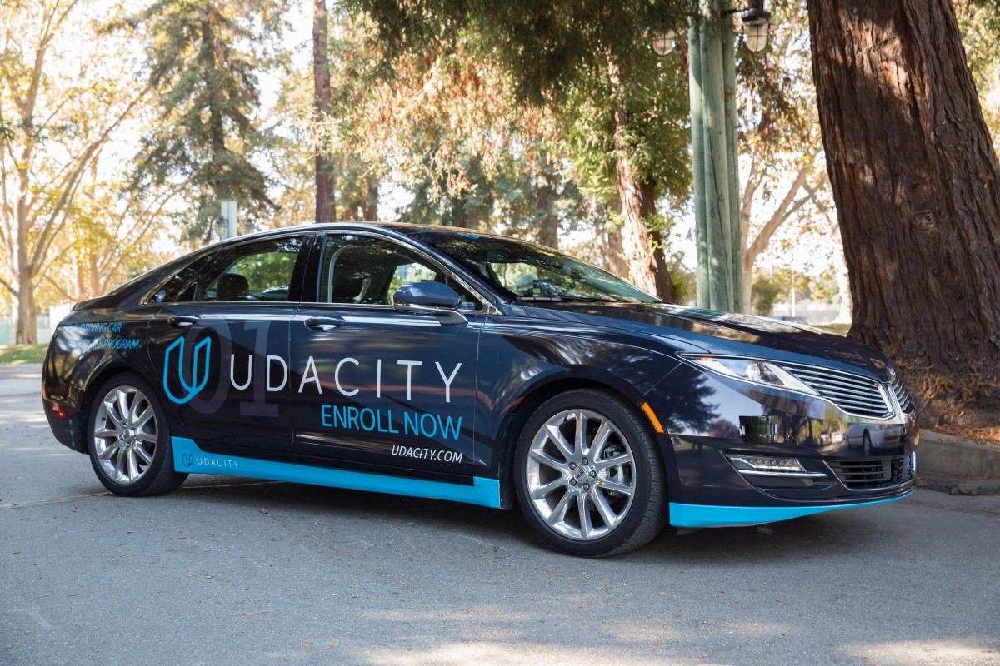
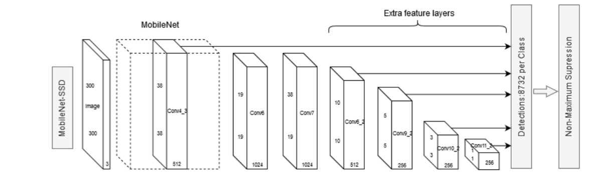
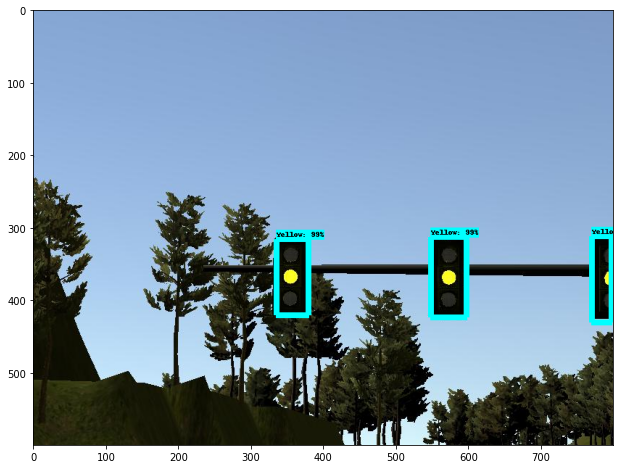
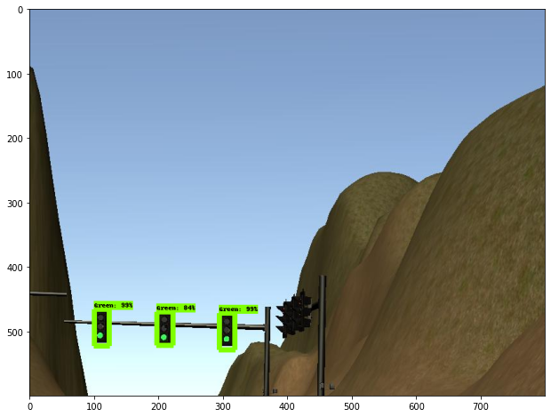
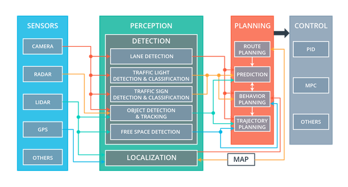
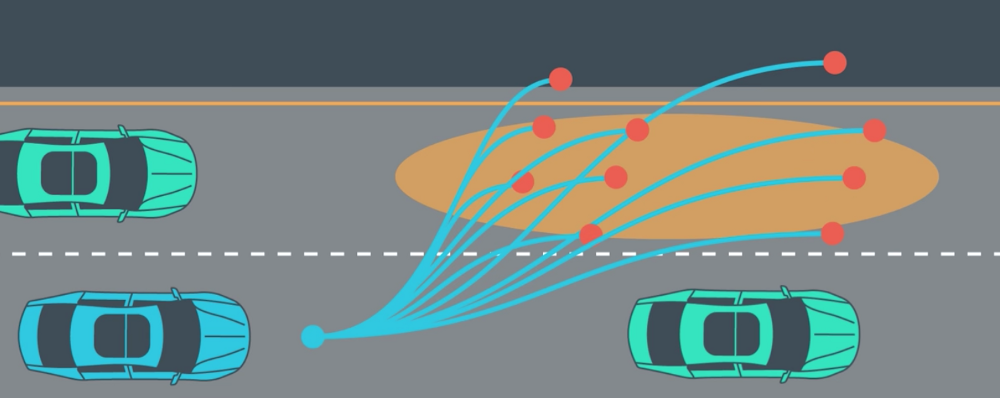

# Self-driving Car Engineer Nanodegree Capstone Project:  Program an Autonomous Vehicle

*Marek Kolodziej, Ph.D. Timothy Lim Yong Lee, M.S., Alejandro Terrazas, Ph.D., Jianzhou Zhao, M.Eng.*

The purpose of this capstone project is to combine the skills garnered by the students in Udacity's Self-driving Car Engineering Nanodegree in order to program Carla, Udacity's self-driving car platform.  The students combined skills in computer vision, vehicle control systems, and integration through the Robot Operating System ([ROS](https://www.ros.org>)).

## Project Aims

The project’s aims were scaled down from a full self-driving car application and, instead focused on 
__1)__ staying in a single lane and __2)__ stopping at red traffic lights.  Goals such as changing lanes, planning optimal routes, and reacting to traffic were not included in this project; although, these topics were covered in other projects during the Nanodegree program.

## Project Stages

The project proceeded in two stages.  First, basic elements of the system were developed to run on Udacity’s simulator (***Figure 1***).  The simulator is a virtual reality 3D environment with three lanes of traffic and eight lights.  There are no other cars in the environment.  In order to pass the first test, the simulated vehicle must stop “safely”, that is smoothly and before the white line, at each red light, decide to stop or continue through each yellow light, and continue through each green light at an appropriate speed.  

***Figure 1: Simulator showing car at the starting position.*** *Manual mode allows the operator to use cursor controls and the mouse to drive the car; otherwise, the car is under control of the waypoint generator (see below).  By clicking the camera box, the user is able to see the view from the simulated car's camera.  The simulator software is developed in [Unity 3D](https://unity.com/).  There are eight different lights situated around the circuitous track.*   

Once the software system passes the first test on the simulator, it is transferred to Udacity’s Carla (***Figure 2***) to run on a real-world (albeit greatly simplified) track.  Of note, the traffic lights encountered on the test track are substantially different than the traffic lights encountered in the simulator.  Moreover, conditions on the test track include glare and poor contrast among other challenges.   

***Figure 2: Carla. Udacity's Self-driving Car Platform.*** *Carla is a fully equiped self-driving car with sensors, a perception module, a planning system and controls.  Once students can pass the simulator test, they are able to run their software on Carla.*

## Object Detection API  

In order to react correctly to the traffic lights, the software system must achieve: __1) Detection.__ Identify the traffic light housing with a bounding box and __2) Classification.__ Look within the bounding box to determine the state of the light (green, yellow, red). This can be done by taking advantage of ***transfer learning*** in which the object detection network is pretrained on a huge image datasets such as the [COCO Dataset](http://cocodataset.org/). [TensorFlow Detection Model Zoo](https://github.com/tensorflow/models/blob/master/research/object_detection/g3doc/detection_model_zoo.md) offers a number of collection of detection models pre-trained on massive datasets. 

The pretrained network selected for use is the `ssd_mobilenet_v2_coco` which is utilising the Single Shot Detector algorithm (SSD, [Liu et al. 2016](https://arxiv.org/abs/1512.02325)) with MobileNet base network trained on the COCO Dataset. 

***Figure 3: The SSD neural network architecture.[Image credit](http://ceur-ws.org/Vol-2500/paper_5.pdf)***

Example of results from directly using the object detection network without editing the output results (Using it right out of the box):


 ***Figure 4: Example image showing bounding boxes surrounding detected objects.***  *The image demonstrates correct detection of two traffic light housings and detection of trees. COCO Datasets already contains traffic lights as one of its object categories.*
 
Since the automotive hardware is closer to mobile or embedded devices than cloud GPUs, the MobileNet neural network designed for running very efficiently (high FPS, low memory footprint) on mobile devices, was integrated as the base network. The MobileNet can reduce the size of cummulative parameters and therefore the computation required on automotive/ mobile hardwares with limited resources ([Andrew et al. 2017](https://arxiv.org/abs/1704.04861>)).


Note that after identify the traffic lights, we will need to run another classification network to detect the state of the light.

**We can bypass the need to run separate networks to identify traffic light and classify the state of the light by making our own custom object detector that immediately detects the state of the traffic lights instead. By doing so, we will only need to run a single network which saves us computational power and it will run faster than having two separate network.**

## Custom Object Detection 

For more information on custom making the object detector to detect our own object of interests, head over to this [Github repo](https://github.com/timothylimyl/Custom-Traffic-Light-State-Detector).

Sample results from custom object detector trained to detect only state of traffic lights:

*Click into the images for a clearer view*
Red Light                  |  Yellow Light    | Green Light
:-------------------------:|:-------------------------:|:-------------------------:
   |  | 


As already noted, the virtual camera and the real-world camera were substantially different (***Figure 4***) The virtual camera on the simulator produces 800 x 600 pixel (height by width) tri-color (blue, green red) images. These images were captured to disk for use in training and testing the computer vision module. In order to address the differences between the simulator and the real-world test track images, a mixture of real and simulator images were used for training, validation, and testing of the computer vision algorithms. Early development of the computer vision system relied on simulator images only. Following success with the simulator testing, additional images from the Carla (Udacity Self Driving Car) were mixed in.

<table><tr>
<td>  </td>
<td>  </td>
</tr></table>  

***Figure 5: Traffic light images from Carla (left) and the Udacity simulator (right).*** *Significant differences can be seen between the two images.  In the Carla real-world image, there is significant reflection from the dash upon the windshield that is not present in the simulator image.  Moreover, the simulator traffic lights are always of the overhead variety and come in groups of three housings, while the Carla image contains a single housing mounted on a post.  The sizes of the images are also different.  The differences between the simulator and Carla images make it necessary to train the light detection and classification module using a mixture of real world and simulator images.*


## Performance of the Traffic Light Detection 

The performance of the detection and classification system was measured separately.  For detection, the goal is to find correct bounding boxes, with a criterion of mean average precision (mAP; reviewed in <https://towardsdatascience.com/breaking-down-mean-average-precision-map-ae462f623a52>). In order to characterize the performance of the detection and classification system, the following metrics were used: __1)__ precision, and __2)__ recall.  

**Testing for Carla on the testing site has not been done as we are awaiting for Udacity to run our code on it**. There has not been an error while running the inference on unseen simulation images.

Sample result of self driving car in simulation:


The car performs as expected, decelerating to a stop when a red light is detected within critical distance and moving once it turns green.

The object detection and classification software was written in Python 3.7 and TensorFlow version 1.15.

# Carla

Udacity’s Carla contains subsystems for __1)__ sensing, __2)__ perception, __3)__ planning and __4)__ control.  These subsystems are described below.  ***Figure 6*** shows an overview of Carla's subsystems. 

 

***Figure 6: Architecture of Carla, the Udacity Self-driving Car.*** *The four modules work independently but exchange data via robot operating system (ROS) nodes (see description of ROS under ***Software Used***, below.* Image borrowed from Udacity Self-driving Car Nanodegree course materials.

***Sensing.*** The sensing subsystem is comprised of several cameras, an inertial measurement unit (IMU), and RADAR and LIDAR sensors.  The camera producing the images provided for this project are mounted behind the windshield (see ***Figure 4 (left)***, above).  Not included in this project (but part of Carla) are a RADAR sensor and a LIDAR sensor, both of which provide the distance to nearby objects. The RADAR is forward facing and only senses the distance to objects in front of the car.  The LIDAR system has a 360-degree view that provides distance to objects in all directions. The GPS provides an estimate of position in global coordinates with 1-2 meters resolution. The IMU estimates displacement of the car in the x (forward-backward), y (left-right) and z (up-down) directions, along with the angular displacement.  

None of the individual sensors are sufficient for localizing the car to the degree needed for safe driving.  Therefore, sensor fusion (combining sensor data) is necessary. GPS coordinates for the lights and car location are provided in the simulator and on the test track; therefore, it is possible to anticipate upcoming lights.

***Perception.***  As in neural and cognitive science, perception differs from sensation in that perception takes the raw input from the sensor and elaborates it into meaningful information.  Meaningful information for a car include traffic light detection and classification (as included in this project), obstacle detection, traffic sign detection, detection of other cars, and, pedestrians.  A substantial part of the effort in the Capstone project involved perceiving the state of the traffic lights.  

***Planning.***  Self-driving cars (and the drivers they will replace) always need to think ahead.  The planning subsystem used in this project was built on the concept of ***waypoints***—a series of coordinates that are updated as the car moves through the environment.  For example, a lane change to the left might be comprised of 20-40 equidistant waypoints in the form of a smooth *s* shape over a 30 meter span.  Note: there is no requirement that the waypoints are equidistant, extend 30 meter, nor that there are 20-40 waypoints that describe the trajectory.  There are many possibilities.  In dense traffic, the parameters may vary substantially from the parameters in sparse traffic.  A real-world planning subsystem would be adaptive to the situation.  Again, this is similar (in concept, if not in detail) to how neural planning systems work.  ***Figure 7*** shows examples of path planning.

 ***Figure 7: Example Path Planning Trajectories for lane changing in heavy traffic.***  *In this example, a multitude of possible paths are considered; however, most of the paths do not have the desired outcomes.  The goal of an effective path planning module is to smoothly transition between cars (and other objects) while maximizing safety and comfort for the passenger.  The path planner must consider the speed of the car ahead in the lane as well as the car to the side and oncoming traffic and generate the correct combination of acceleration and steering to avoid other cars and land in the gap.* Example taken from path planning course materials from Udacity's Self-driving Car Engineer Nanodegree.

***Control.***  Finally, after planning comes execution of the commands that control the car.  As in human driving, there are a limited number of controls that, in combination, create a complex series of behaviors.  Carla is equipped with a drive-by-wire controller to control __1)__ acceleration, __2)__ braking and __3)__ steering.  Carla uses a proportional-integral-derivative (PID) controller.  

## The Testing Track

After passing the simulator test, the testing moved to the real world using Carla. Some minor modification to the code (setting flags) was necessary in order to run the code on Carla; however, the goal was to produce one software system that could successfuly drive *without human intervention* on both the simulator and Carla.

# Software Used

### Robot Operating System (ROS)

From the ROS website: *ROS (Robot Operating System) provides libraries and tools to help software developers create robot applications. It provides hardware abstraction, device drivers, libraries, visualizers, message-passing, package management, and more. ROS is licensed under an open source, BSD license.*

ROS is an open source software framework developed initially by Willow Garage (<http://www.willowgarage.com>) and is ideally suited for complex robot operations that often involve multiple systems running independently. For example, the multiple modules in Carla include: __1)__ a camera that produces raw images, __2)__ the object detection and classification system which consumes the raw images and produces the state of the light (i.e., green, yellow, red), __3)__ a decision-making system that decides whether to stop at a light or continue through it, and __4)__ the vehicle control system that is responsible for steering, accelerating and decelerating the car, just to name a few.  Indeed, most robots and autonomous vehicles are may contain dozens of interacting modules. Writing a single program that integrates all of the modules in a self-driving car would be very challenging, to say the least. 

 ***Figure 8: ROS architechure showing the ROS nodes and topics used in the project.***

ROS allows these systems to run independently while, at the same time, exchanging messages. The main mechanism for communicating between modules is through a “publisher-subscription” (commonly referred to as a “pub-sub” model). In certain cases, asynchronous communications, in which one subsystem can interrupt and block the processing of another system, are required. ROS supports both message passing protocols.

Another important benefit of using ROS is the large number of device drivers that are included with the distribution.  These device drivers support many of the most popular sensors (cameras, LIDAR, RADAR, IMU) and actuators (motors and controls). The easy integration of the supported devices means that developers are able to focus more effort on integration.

ROS has several tools that aid in the development of an integrated system. The system developer can “peer into” the messages being exchanged and store these in a “[bag](http://wiki.ros.org/Bags)” file, which can can be replayed to the system.  Replaying past data ensures that conditions can be replicated during failure analysis.

# Installation and Execution

### In the Udacity workspace / on Carla

**Note:** Performance on the Udacity workspace was extremely slow.  Even without the deep learning model, the ROS nodes wouldn't exchange the data from the simulator fast enough, and so the simulator feedback was delayed so much so as not to meet real-time requirements. It is possible to run fast enough in the workspace, if the waypoint updater's frequency is reduced from 50 Hz to 15 Hz. This is good enough because autonomy disengages at 10 Hz, however clearly it's not realistic for a real car. The simulator should run fine with that setting, though. The Docker environment discussed below enabled deployment on a system that was fast enough for real-time (50 Hz). It's possible that Carla would run at 50 Hz with the workspace settings, too.

Checking out the master branch of this repository will run fine in the workspace environment. To follow the Docker steps for better performance on other machines, please check out the docker branch instead.

Workspace steps:

* Clone the repo:
```
git clone https://github.com/CarNDCapstone/CarND-Capstone.git && cd CarND-Capstone
```
* Install requirements
```
pip install -r requirements.txt
```
* Change dir to ros and run catkin_make
```
cd ros && catkin_make
```
* Load env vars
```
source devel/setup.bash
```
* Start ROS nodes
```
roslaunch launch/styx.launch
```
* Start the Udacity simulator as usual

### In a Docker container

0. **Hardware specs tested**

The simulator requires significant CPU power, as does ROS. If the neural network is running on CPU too, that will further tax the CPU. A GPU will substantially reduce CPU processing. Two setups were tried, both of which were fast enough for the model to run at expected frame rates.

* Setup 1:
    * Linux laptop (2019 System76 Oryx Pro)
    * Ubuntu 18.04 LTS
    * 32 GB RAM
    * 6-core Intel CPU (Intel(R) Core(TM) i7-9750H CPU @ 2.60GHz)
    * NVIDIA RTX 2070 GPU (CUDA compute capability 7.5, Turing architecture)
    * [Docker 19.03.8](https://www.docker.com/)
    * [nvidia-docker](https://github.com/NVIDIA/nvidia-docker)
* Setup 2:
    * Apple laptop (2019 Macbook Pro)
    * MacOS Catalina (10.15.3)
    * 32 GB RAM
    * 6-core Core i7 CPU
    * Docker for MacOS with virtualization via HyperKit

1. **Clone the repository**

The repository can be found [here](https://github.com/CarNDCapstone/CarND-Capstone). To clone the repository, type:

* Clone the repository with the docker branch 
```
git clone https://github.com/CarNDCapstone/CarND-Capstone.git -b docker
```
Also, make sure to change directories to the repo:
```
cd CarND-Capstone
```

2. **Set up Docker** 

This setup depends on a [Docker](https://www.docker.com/) image. For more information about Docker containers, click [here](https://www.docker.com/resources/what-container).

**Why Docker?**
* Makes software portable across platforms, like a virtual machine.
* Zero overhead when run on Linux (VMs can have a lot overhead - definitely I/O, sometimes compute, depending on the [hypervisor](https://en.wikipedia.org/wiki/Hypervisor))
* GPU acceleration - VMs don't allow the user to run CUDA. This is because CUDA in a Linux VM would expect to talk to a native Linux driver.  Nevertheless, the host OS can be Linux, Windows or MacOS. By contrast, Docker containers running on Linux hosts can access CUDA-capable GPUs for compute (see the GPU Acceleration section below).


**Docker runtime installation instructions**

* [Ubuntu Linux](https://docs.docker.com/install/linux/docker-ce/ubuntu/)
* [CentOS Linux](https://docs.docker.com/install/linux/docker-ce/centos/)
* [RHEL Linux](https://docs.docker.com/ee/docker-ee/rhel/)
* [MacOS](https://download.docker.com/mac/stable/Docker.dmg)
* [Windows](https://download.docker.com/win/stable/Docker%20Desktop%20Installer.exe)

**Note:** The software was tested on Ubuntu Linux and MacOS only.

**GPU acceleration:** The code uses neural network detection and classification for the traffic light model. GPU acceleration is only available in this setup when Docker runs natively on Linux. Fortunately, the detection model is fast enough on a CPU; however, using GPU acceleration is recommended.

Supported GPUs include: Tesla K80, Tesla M60, Tesla P100, Tesla V100, GTX 1070/1080/1080Ti, RTX 2070/2080/2080Ti. Titan X, Titan XP and Titan RTX should also work.

To get GPU acceleration, after installing Docker, install [nvidia-docker](https://github.com/NVIDIA/nvidia-docker). Find the nvidia-docker instructions from the [NVIDIA github repo](https://github.com/NVIDIA/nvidia-docker) here.

*nvidia-docker setup on Ubuntu Linux*

```
# Add the package repositories
distribution=$(. /etc/os-release;echo $ID$VERSION_ID)
curl -s -L https://nvidia.github.io/nvidia-docker/gpgkey | sudo apt-key add -
curl -s -L https://nvidia.github.io/nvidia-docker/$distribution/nvidia-docker.list | sudo tee /etc/apt/sources.list.d/nvidia-docker.list

sudo apt-get update && sudo apt-get install -y nvidia-container-toolkit
sudo systemctl restart docker

```

*nvidia-docker setup on CentOS 7 / RHEL 7*

```
distribution=$(. /etc/os-release;echo $ID$VERSION_ID)
curl -s -L https://nvidia.github.io/nvidia-docker/$distribution/nvidia-docker.repo | sudo tee /etc/yum.repos.d/nvidia-docker.repo

sudo yum install -y nvidia-container-toolkit
sudo systemctl restart docker
```

For an NVIDIA GPU and correctly installed Docker and nvidia-docker, running a CUDA container (automatically pulled) will show the driver version (here 440.59) and GPU type (here GeForce RTX 2070):

```
docker run --rm -it nvidia/cuda nvidia-smi
Sun Mar 29 21:32:42 2020       
+-----------------------------------------------------------------------------+
| NVIDIA-SMI 440.59       Driver Version: 440.59       CUDA Version: 10.2     |
|-------------------------------+----------------------+----------------------+
| GPU  Name        Persistence-M| Bus-Id        Disp.A | Volatile Uncorr. ECC |
| Fan  Temp  Perf  Pwr:Usage/Cap|         Memory-Usage | GPU-Util  Compute M. |
|===============================+======================+======================|
|   0  GeForce RTX 2070..  Off  | 00000000:01:00.0 Off |                  N/A |
| N/A   40C    P8     9W /  N/A |   1478MiB /  7982MiB |      5%      Default |
+-------------------------------+----------------------+----------------------+
                                                                               
+-----------------------------------------------------------------------------+
| Processes:                                                       GPU Memory |
|  GPU       PID   Type   Process name                             Usage      |
|=============================================================================|
+-----------------------------------------------------------------------------+

```

**Docker without sudo:** Normally, starting a Docker container requires `sudo`. This requirement can be removed by configuring the Docker runtme correctly. On MacOS and Windows, this should be the default. On Linux, one has to issue a few commands:
```
sudo groupadd docker
sudo usermod -aG docker $USER
newgrp docker
```

Docker should now be runnable without sudo:

```
docker run --rm hello-world
```

If Docker is complaining about the daemon not being up, try logging out and logging back in. If that doesn't help, reboot the machine before moving onto next steps. 

**Memory issues on MacOS:** Docker lets containers use only 2 GB RAM on MacOS by default. Open the Docker app on MacOS, click Settings, and change to at least 4 GB. More is preferable.


3. **Pull Docker container or build from source**

The container is already pre-built and is available on [Dockerhub](https://hub.docker.com/r/mkolod/udacity_carnd_capstone). Pull the container as follows:
```
docker pull mkolod/udacity_carnd_capstone
```

To build the container from source, note that there are two Dockerfiles at the root of the CarND-Capstone repository that were cloned earlier. Build using `Dockerfile-modern-gpu`. To do that, issue the following command while at the root of the repo:
```
docker build -t mkolod/udacity_carnd_capstone -f Dockerfile_modern_gpu .
```
This will build a Docker image called `mkolod/udacity_carnd_capstone`. Note that building from source may take a few minutes. Above `-f` specifies the Dockerfile to use (by default the build will use a file called `Dockerfile`) and `-t` stands for "tag," i.e. to name the container. Name it the same as the version pulled from Dockerhub.

4. **Install the Udacity simulator**

The instructions for how to install the simulator different platforms (Mac, PC, Linux) can be found [here](https://github.com/udacity/CarND-Capstone/releases/tag/v1.3).

5. **Launch the container**

While still at the root of the CarND-Capstone repository, launch a Docker container
```
docker run --rm -it -p 4567:4567 -v `pwd`:/workspace mkolod/udacity_carnd_capstone
```

The above command creates an ephemeral container, that is removed after typing `exit` in the shell session (`--rm` flag). Launch an interactive conatiner with a terminal (`-it` for "interactive terminal"). Expose port 4567 since this is the port ROS uses to communicate with the Udacity simulator. Since Docker containers run with their own ephemeral filesystem, to mount the repository inside the container pass the volume argument (`-v` for "volume"). The repository will then be mounted into the container under the `/workspace` path.

When the Docker container launches, the user will normally be root, and the hostname will be some hash; therefore, expect a prompt like the following once the container launches:
```
root@28064d9756ab:/capstone/ros
```

**Launch with GPU support:** On the Linux OS, there will be an NVIDIA GPU and a recent NVIDIA driver (this project tested with `440.59`). For the `nvidia-docker` installation described above, add the `--gpus all` flag while launching the container. The full launch command would look like so:

```
docker run --rm -it -p 4567:4567 -v `pwd`:/workspace --gpus all mkolod/udacity_carnd_capstone
```

6. **Set up ROS environment and launch nodes**

After mounting the cloned repository in Docker under `/workspace`, change directories.

```
cd /workspace/ros
```

Now, run `catkin_make` to build the catkin nodes.

```
catkin_make
```

Before launching the nodes, set up the shell environment:
```
source devel/setup.bash
```

Now, launch the ROS nodes:

```
roslaunch launch/styx.launch
```

Output will be logged to the terminal after this command is run.  The terminal output will include warnings such as the following:


```
[ WARN] [1585517476.418286130]: position is missing
[ WARN] [1585517476.418361765]: waypoint is missing
[ WARN] [1585517476.418408371]: velocity is missing
```

The warnings will go away once the simulator is launched.

7. **Launch the Udacity simulator**

Assuming a 64-bit Linux , starting the simulator.

```
./sys_int.x86_64
```
A menu will appear, asking for the preferred resolution and rendering quality. If the machine specs are unknown, it's best to first start with the smallest or next-to-smallest resolution and work up from there to see if the machine is responsive enough. So, first select 800x600. The rendering quality doesn't vary much, but higher settings tax the CPU, so select "Fastest."

Next, select the "Highway" simulator. 

When the simulator launches, select the "Camera" check box to provide the video feed to the traffic light detector, and unselect "Manual" to enable drive-by-wire (DBW).

The simulator launch will be similar for MacOS and Windows. Follow the OS-specific instructions provided by Udacity.

## Demo YouTube video

To see the full simulator track run, click [here](https://www.youtube.com/watch?v=eEbDz6ZHaAg).

